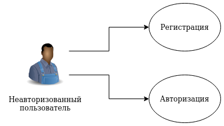
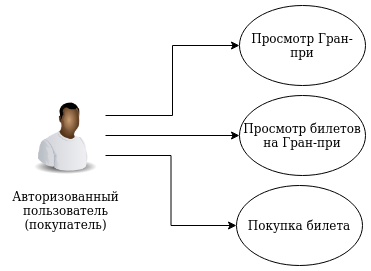
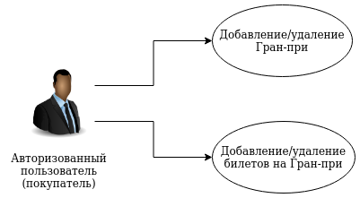
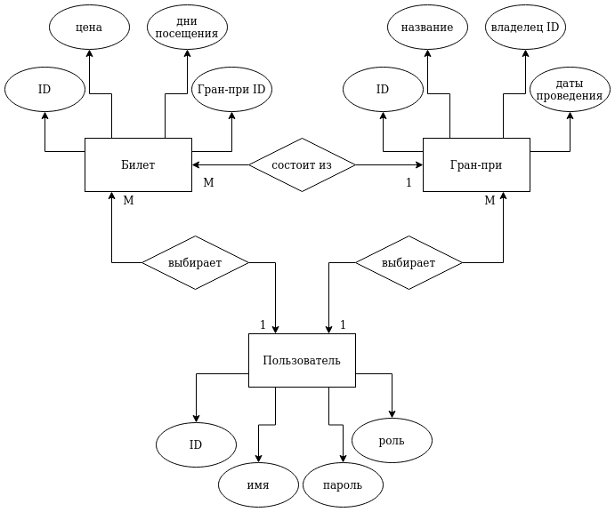

# Web (Fall 2021)
:computer: Web-приложение (дисциплина "Веб-программирование") :computer:

## :dart: Цель работы 
Разработать приложение-агрегатор для покупки билетов на Гран-при [Формулы 1](https://www.formula1.com/) :racing_car: :racing_car: :racing_car:.

## :scroll: Список функциональных требований
* Регистрация пользователей
* Авторизация пользователя
* Просмотр Гран-при
* Просмотр билетов на Гран-при
* Покупка билета

## :information_desk_person: Use-case diagrams
* Неавторизованный пользователь  

* Авторизованный пользователь (покупатель)  

* Авторизованный пользователь (вендор)  

## :round_pushpin: ER-diagram
ER-диаграмма в нотации Чена  

